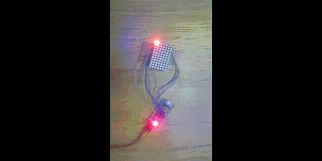

# stm32f103-ledmatrix
stm32f103 HAL GPIO Conway's game of life led matrix



The led matrix is 7 rows by 11 columns.
PA0 - PA10 are connected to led cathodes (columns).
PB0 - PB6  are connected to led anodes (rows).

## How to build
connect stlink/stlinkv2 to debug wire pins and
```
make
make flash
```

## TODO
Fill the initial array with random pattern.